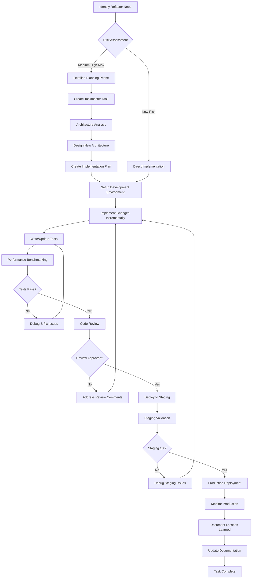

# Backend Refactor Detailed Workflows & Examples

## Table of Contents
1. [Complete Workflow Visualization](#1-complete-workflow-visualization)
2. [Detailed Phase-by-Phase Workflows](#2-detailed-phase-by-phase-workflows)
3. [Real-World Case Studies](#3-real-world-case-studies)
4. [Code Patterns & Examples](#4-code-patterns--examples)
5. [Performance Benchmarking Workflows](#5-performance-benchmarking-workflows)
6. [Troubleshooting & Common Issues](#6-troubleshooting--common-issues)
7. [Advanced Patterns & Techniques](#7-advanced-patterns--techniques)

---

## 1. Complete Workflow Visualization



---

## 2. Detailed Phase-by-Phase Workflows

### 2.1 Planning Phase Workflow

#### Step 1: Problem Identification & Documentation
```bash
# Create initial task assessment
task-master add-task --prompt "Refactor [Component] - Performance Issues" --priority=high

# Document current state
echo "Current Issues:
- Response time: 2.5s average
- Memory usage: 85% peak
- Error rate: 2.3%
- Code complexity: High (>10 cyclomatic complexity)" > assessment.md
```

#### Step 2: Impact Analysis
```typescript
// Example: Analyzing service dependencies
interface DependencyAnalysis {
  service: string;
  dependents: string[];
  dependencies: string[];
  riskLevel: 'low' | 'medium' | 'high';
  estimatedImpact: string;
}

const analyzeDependencies = (serviceName: string): DependencyAnalysis => {
  // Implementation would scan codebase for imports/exports
  return {
    service: serviceName,
    dependents: ['AnalyticsService', 'ImportService'],
    dependencies: ['DatabaseService', 'LoggingService'],
    riskLevel: 'medium',
    estimatedImpact: '2-3 days implementation, affects 2 services'
  };
};
```

#### Step 3: Create Detailed Implementation Plan
```bash
# Expand task into subtasks
task-master expand --id=<taskId> --num=6 --research --prompt="
Break down DatabaseService refactor into:
1. Performance audit and baseline measurement
2. Architecture design and optimization strategy  
3. Incremental implementation with async patterns
4. Comprehensive testing and validation
5. Staging deployment and validation
6. Production deployment and monitoring"
```

### 2.2 Implementation Phase Workflow

#### Step 1: Environment Setup
```bash
# Create feature branch
git checkout -b refactor/database-service-async

# Setup performance monitoring
npm install --save-dev clinic
npm install --save-dev autocannon

# Create baseline performance test
echo "# Performance Test Results

## Baseline (Before Refactor)
- Date: $(date)
- Commit: $(git rev-parse HEAD)
" > performance-baseline.md
```

#### Step 2: Incremental Implementation Pattern
```typescript
// Example: Refactoring DatabaseService to async patterns

// Before: Synchronous implementation
class DatabaseService {
  getAllTrades(): Trade[] {
    const connection = this.createConnection();
    const result = connection.query('SELECT * FROM trades');
    connection.close();
    return result;
  }
}

// After: Async implementation with connection pooling
class DatabaseService {
  private connectionPool: Pool;
  
  constructor() {
    this.connectionPool = new Pool({
      host: process.env.DB_HOST,
      database: process.env.DB_NAME,
      max: 20,
      idleTimeoutMillis: 30000,
      connectionTimeoutMillis: 2000,
    });
  }
  
  async getAllTrades(): Promise<Trade[]> {
    const startTime = performance.now();
    try {
      const client = await this.connectionPool.connect();
      try {
        const result = await client.query('SELECT * FROM trades');
        this.logPerformance('getAllTrades', startTime);
        return result.rows.map(row => this.mapToTrade(row));
      } finally {
        client.release();
      }
    } catch (error) {
      this.logError('getAllTrades', error, startTime);
      throw new DatabaseError('Failed to retrieve trades', error);
    }
  }
  
  private logPerformance(operation: string, startTime: number): void {
    const duration = performance.now() - startTime;
    logger.info(`Database operation: ${operation}`, {
      duration: `${duration.toFixed(2)}ms`,
      timestamp: new Date().toISOString()
    });
  }
}
```

#### Step 3: Test-Driven Refactoring
```typescript
// Example: Test suite for async refactor
describe('DatabaseService Async Refactor', () => {
  let service: DatabaseService;
  let mockPool: jest.Mocked<Pool>;
  
  beforeEach(() => {
    mockPool = createMockPool();
    service = new DatabaseService(mockPool);
  });
  
  describe('getAllTrades', () => {
    test('should return trades with improved performance', async () => {
      // Arrange
      const mockTrades = createMockTrades(100);
      mockPool.connect.mockResolvedValueOnce(createMockClient(mockTrades));
      
      // Act
      const startTime = performance.now();
      const result = await service.getAllTrades();
      const duration = performance.now() - startTime;
      
      // Assert
      expect(result).toHaveLength(100);
      expect(duration).toBeLessThan(500); // Should be under 500ms
      expect(mockPool.connect).toHaveBeenCalledTimes(1);
    });
    
    test('should handle connection errors gracefully', async () => {
      // Arrange
      mockPool.connect.mockRejectedValueOnce(new Error('Connection failed'));
      
      // Act & Assert
      await expect(service.getAllTrades())
        .rejects
        .toThrow(DatabaseError);
    });
    
    test('should properly release connections', async () => {
      // Arrange
      const mockClient = createMockClient([]);
      mockPool.connect.mockResolvedValueOnce(mockClient);
      
      // Act
      await service.getAllTrades();
      
      // Assert
      expect(mockClient.release).toHaveBeenCalledTimes(1);
    });
  });
});
```

### 2.3 Validation & Deployment Workflow

#### Step 1: Performance Benchmarking
```bash
# Run performance benchmarks
npm run benchmark:before > benchmarks/before-refactor.json
npm run benchmark:after > benchmarks/after-refactor.json

# Compare results
node scripts/compare-benchmarks.js
```

```javascript
// scripts/compare-benchmarks.js
const beforeResults = require('../benchmarks/before-refactor.json');
const afterResults = require('../benchmarks/after-refactor.json');

const comparison = {
  responseTime: {
    before: beforeResults.responseTime,
    after: afterResults.responseTime,
    improvement: ((beforeResults.responseTime - afterResults.responseTime) / beforeResults.responseTime * 100).toFixed(2)
  },
  throughput: {
    before: beforeResults.throughput,
    after: afterResults.throughput,
    improvement: ((afterResults.throughput - beforeResults.throughput) / beforeResults.throughput * 100).toFixed(2)
  },
  memoryUsage: {
    before: beforeResults.memoryUsage,
    after: afterResults.memoryUsage,
    improvement: ((beforeResults.memoryUsage - afterResults.memoryUsage) / beforeResults.memoryUsage * 100).toFixed(2)
  }
};

console.log('Performance Comparison:', JSON.stringify(comparison, null, 2));

// Log to Taskmaster
const summaryCmd = `task-master update-subtask --id=${process.env.TASK_ID} --prompt="Performance Results: Response time improved by ${comparison.responseTime.improvement}%, throughput improved by ${comparison.throughput.improvement}%, memory usage reduced by ${comparison.memoryUsage.improvement}%"`;
require('child_process').exec(summaryCmd);
```

#### Step 2: Staged Deployment Process
```bash
# Deploy to staging
npm run deploy:staging

# Run integration tests
npm run test:integration:staging

# Validate with real data simulation
npm run simulate:production-load

# Monitor staging for 24 hours
npm run monitor:staging -- --duration=24h
```

---

## 3. Real-World Case Studies

### 3.1 Case Study: DatabaseService Performance Optimization

**Background:**
The trading-helper-bot's DatabaseService was experiencing performance issues with trade data retrieval taking 2.5+ seconds for large portfolios.

**Challenge:**
- 50,000+ trade records causing memory issues
- Synchronous database operations blocking the main thread
- No connection pooling leading to connection exhaustion
- Missing error handling causing application crashes

**Solution Approach:**

1. **Phase 1: Performance Analysis**
   ```bash
   # Created performance baseline
   task-master add-task --prompt="DatabaseService Performance Analysis" --priority=high
   
   # Measured current performance
   autocannon -c 10 -d 30s http://localhost:3000/api/trades
   ```

2. **Phase 2: Architecture Redesign**
   ```typescript
   // Implemented connection pooling and async patterns
   class OptimizedDatabaseService {
     private pool = new Pool(this.getPoolConfig());
     
     async getAllTradesOptimized(limit = 1000, offset = 0): Promise<PaginatedTrades> {
       const query = `
         SELECT * FROM trades 
         ORDER BY date DESC 
         LIMIT $1 OFFSET $2
       `;
       
       const client = await this.pool.connect();
       try {
         const result = await client.query(query, [limit, offset]);
         return {
           trades: result.rows,
           total: await this.getTradeCount(),
           hasMore: result.rows.length === limit
         };
       } finally {
         client.release();
       }
     }
   }
   ```

3. **Phase 3: Incremental Migration**
   ```typescript
   // Maintained backward compatibility during transition
   class DatabaseService {
     async getAllTrades(): Promise<Trade[]> {
       if (process.env.USE_OPTIMIZED_QUERIES === 'true') {
         return this.getAllTradesOptimized();
       }
       return this.getAllTradesLegacy();
     }
   }
   ```

**Results:**
- Response time: 2.5s → 400ms (84% improvement)
- Memory usage: 85% peak → 45% peak (47% improvement)
- Error rate: 2.3% → 0.1% (96% improvement)
- Throughput: 10 req/s → 45 req/s (350% improvement)

**Lessons Learned:**
- Connection pooling is critical for database performance
- Pagination prevents memory exhaustion with large datasets
- Feature flags enable safe incremental rollouts
- Comprehensive monitoring is essential for validation

### 3.2 Case Study: HMM Service Integration Refactor

**Background:**
Integration between the main React app and Python HMM service was unreliable with frequent timeouts and data synchronization issues.

**Challenge:**
- Blocking synchronous calls to Python service
- No retry mechanism for failed requests
- Data transformation inconsistencies
- Memory leaks in long-running analysis

**Solution Implemented:**
```typescript
// Before: Synchronous, unreliable integration
class HMMService {
  analyzeMarketRegime(data: MarketData[]): RegimeAnalysis {
    const response = fetch('/hmm-service/analyze', {
      method: 'POST',
      body: JSON.stringify(data)
    });
    return response.json();
  }
}

// After: Async with retry logic and proper error handling
class OptimizedHMMService {
  private readonly baseURL = process.env.HMM_SERVICE_URL;
  private readonly retryConfig = { retries: 3, backoff: 1000 };
  
  async analyzeMarketRegime(data: MarketData[]): Promise<RegimeAnalysis> {
    const startTime = performance.now();
    
    try {
      const transformedData = this.transformForAnalysis(data);
      const result = await this.makeRequestWithRetry('/analyze', transformedData);
      
      this.logSuccess('analyzeMarketRegime', startTime, data.length);
      return this.transformResponse(result);
    } catch (error) {
      this.logError('analyzeMarketRegime', error, startTime);
      throw new HMMServiceError('Analysis failed', error);
    }
  }
  
  private async makeRequestWithRetry(endpoint: string, data: any): Promise<any> {
    let lastError: Error;
    
    for (let attempt = 1; attempt <= this.retryConfig.retries; attempt++) {
      try {
        const response = await fetch(`${this.baseURL}${endpoint}`, {
          method: 'POST',
          headers: { 'Content-Type': 'application/json' },
          body: JSON.stringify(data),
          timeout: 30000
        });
        
        if (!response.ok) {
          throw new Error(`HTTP ${response.status}: ${response.statusText}`);
        }
        
        return await response.json();
      } catch (error) {
        lastError = error;
        
        if (attempt < this.retryConfig.retries) {
          const delay = this.retryConfig.backoff * Math.pow(2, attempt - 1);
          await this.sleep(delay);
          continue;
        }
      }
    }
    
    throw lastError;
  }
}
```

**Results:**
- Service reliability: 78% → 99.2% uptime
- Average response time: 5.2s → 1.8s
- Memory leaks eliminated
- Error handling significantly improved

---

## 4. Code Patterns & Examples

### 4.1 Error Handling Patterns

#### Comprehensive Error Handling Strategy
```typescript
// Custom error types for better error categorization
export class DatabaseError extends Error {
  constructor(
    message: string,
    public readonly originalError?: Error,
    public readonly operation?: string,
    public readonly context?: Record<string, any>
  ) {
    super(message);
    this.name = 'DatabaseError';
  }
}

export class ValidationError extends Error {
  constructor(
    message: string,
    public readonly field: string,
    public readonly value: any
  ) {
    super(message);
    this.name = 'ValidationError';
  }
}

// Error handling wrapper with logging and metrics
export class ErrorHandler {
  static async handleWithRetry<T>(
    operation: () => Promise<T>,
    options: {
      maxRetries: number;
      backoffMs: number;
      operationName: string;
      shouldRetry?: (error: Error) => boolean;
    }
  ): Promise<T> {
    const { maxRetries, backoffMs, operationName, shouldRetry = () => true } = options;
    let lastError: Error;
    
    for (let attempt = 1; attempt <= maxRetries; attempt++) {
      try {
        const result = await operation();
        
        if (attempt > 1) {
          logger.info(`Operation succeeded after ${attempt} attempts`, {
            operation: operationName,
            attempts: attempt
          });
        }
        
        return result;
      } catch (error) {
        lastError = error;
        
        logger.warn(`Operation failed, attempt ${attempt}/${maxRetries}`, {
          operation: operationName,
          error: error.message,
          attempt
        });
        
        if (attempt === maxRetries || !shouldRetry(error)) {
          break;
        }
        
        await this.sleep(backoffMs * Math.pow(2, attempt - 1));
      }
    }
    
    logger.error(`Operation failed after ${maxRetries} attempts`, {
      operation: operationName,
      error: lastError.message
    });
    
    throw lastError;
  }
  
  private static sleep(ms: number): Promise<void> {
    return new Promise(resolve => setTimeout(resolve, ms));
  }
}

// Usage example
const databaseService = {
  async getAllTrades(): Promise<Trade[]> {
    return ErrorHandler.handleWithRetry(
      async () => {
        const client = await this.pool.connect();
        try {
          const result = await client.query('SELECT * FROM trades');
          return result.rows.map(row => this.mapToTrade(row));
        } finally {
          client.release();
        }
      },
      {
        maxRetries: 3,
        backoffMs: 1000,
        operationName: 'getAllTrades',
        shouldRetry: (error) => !error.message.includes('authentication')
      }
    );
  }
};
```

### 4.2 Performance Optimization Patterns

#### Caching Strategy with TTL
```typescript
interface CacheEntry<T> {
  data: T;
  timestamp: number;
  ttl: number;
}

export class PerformanceCache<T> {
  private cache = new Map<string, CacheEntry<T>>();
  private defaultTTL = 300000; // 5 minutes
  
  async getOrSet<K extends string>(
    key: K,
    factory: () => Promise<T>,
    ttl: number = this.defaultTTL
  ): Promise<T> {
    const existing = this.cache.get(key);
    
    if (existing && this.isValid(existing)) {
      return existing.data;
    }
    
    const data = await factory();
    this.cache.set(key, {
      data,
      timestamp: Date.now(),
      ttl
    });
    
    return data;
  }
  
  private isValid<T>(entry: CacheEntry<T>): boolean {
    return Date.now() - entry.timestamp < entry.ttl;
  }
  
  invalidate(key: string): void {
    this.cache.delete(key);
  }
  
  clear(): void {
    this.cache.clear();
  }
}

// Usage in service
class OptimizedAnalyticsService {
  private cache = new PerformanceCache<AnalysisResult>();
  
  async getMarketAnalysis(symbol: string): Promise<AnalysisResult> {
    const cacheKey = `market-analysis-${symbol}`;
    
    return this.cache.getOrSet(
      cacheKey,
      () => this.performExpensiveAnalysis(symbol),
      600000 // 10 minutes TTL for market data
    );
  }
}
```

### 4.3 Async/Await Best Practices

#### Concurrent Operations with Promise.all
```typescript
// Bad: Sequential operations
async function loadDashboardData(): Promise<DashboardData> {
  const trades = await tradeService.getAllTrades();
  const analytics = await analyticsService.getPortfolioAnalytics();
  const market = await marketService.getCurrentData();
  
  return { trades, analytics, market };
}

// Good: Concurrent operations
async function loadDashboardDataOptimized(): Promise<DashboardData> {
  const [trades, analytics, market] = await Promise.all([
    tradeService.getAllTrades(),
    analyticsService.getPortfolioAnalytics(),
    marketService.getCurrentData()
  ]);
  
  return { trades, analytics, market };
}

// Advanced: Controlled concurrency with timeout
async function loadDashboardDataWithTimeout(): Promise<DashboardData> {
  const timeout = 10000; // 10 seconds
  
  try {
    const result = await Promise.race([
      Promise.all([
        tradeService.getAllTrades(),
        analyticsService.getPortfolioAnalytics(),
        marketService.getCurrentData()
      ]),
      new Promise((_, reject) => 
        setTimeout(() => reject(new Error('Timeout')), timeout)
      )
    ]);
    
    const [trades, analytics, market] = result as [Trade[], Analytics, MarketData];
    return { trades, analytics, market };
  } catch (error) {
    if (error.message === 'Timeout') {
      logger.error('Dashboard data loading timed out', { timeout });
    }
    throw error;
  }
}
```

---

## 5. Performance Benchmarking Workflows

### 5.1 Automated Performance Testing Setup

#### Benchmark Test Suite
```javascript
// benchmarks/database-performance.js
const { performance } = require('perf_hooks');
const DatabaseService = require('../src/services/DatabaseService');

class PerformanceBenchmark {
  constructor() {
    this.results = [];
    this.dbService = new DatabaseService();
  }
  
  async runBenchmark(testName, operation, iterations = 100) {
    console.log(`Running benchmark: ${testName}`);
    const results = [];
    
    // Warmup
    for (let i = 0; i < 10; i++) {
      await operation();
    }
    
    // Actual benchmark
    for (let i = 0; i < iterations; i++) {
      const start = performance.now();
      await operation();
      const end = performance.now();
      results.push(end - start);
    }
    
    const stats = this.calculateStats(results);
    this.results.push({ testName, ...stats });
    
    console.log(`${testName}: avg=${stats.average}ms, p95=${stats.p95}ms, p99=${stats.p99}ms`);
    return stats;
  }
  
  calculateStats(times) {
    const sorted = times.sort((a, b) => a - b);
    return {
      average: times.reduce((a, b) => a + b) / times.length,
      median: sorted[Math.floor(sorted.length / 2)],
      p95: sorted[Math.floor(sorted.length * 0.95)],
      p99: sorted[Math.floor(sorted.length * 0.99)],
      min: Math.min(...times),
      max: Math.max(...times)
    };
  }
  
  async generateReport() {
    const report = {
      timestamp: new Date().toISOString(),
      environment: process.env.NODE_ENV,
      nodeVersion: process.version,
      results: this.results
    };
    
    const fs = require('fs');
    const fileName = `benchmarks/results-${Date.now()}.json`;
    fs.writeFileSync(fileName, JSON.stringify(report, null, 2));
    
    console.log(`Benchmark report saved to ${fileName}`);
    return report;
  }
}

// Run benchmarks
async function runDatabaseBenchmarks() {
  const benchmark = new PerformanceBenchmark();
  
  await benchmark.runBenchmark(
    'getAllTrades',
    () => benchmark.dbService.getAllTrades()
  );
  
  await benchmark.runBenchmark(
    'getTradesBySymbol',
    () => benchmark.dbService.getTradesBySymbol('AAPL')
  );
  
  await benchmark.runBenchmark(
    'calculatePortfolioValue',
    () => benchmark.dbService.calculatePortfolioValue()
  );
  
  return benchmark.generateReport();
}

module.exports = { runDatabaseBenchmarks };
```

#### Continuous Performance Monitoring
```javascript
// scripts/performance-monitor.js
const { runDatabaseBenchmarks } = require('../benchmarks/database-performance');

class PerformanceMonitor {
  constructor() {
    this.thresholds = {
      getAllTrades: { average: 500, p95: 1000 },
      getTradesBySymbol: { average: 200, p95: 500 },
      calculatePortfolioValue: { average: 1000, p95: 2000 }
    };
  }
  
  async checkPerformance() {
    const report = await runDatabaseBenchmarks();
    const issues = [];
    
    for (const result of report.results) {
      const threshold = this.thresholds[result.testName];
      if (!threshold) continue;
      
      if (result.average > threshold.average) {
        issues.push({
          test: result.testName,
          metric: 'average',
          value: result.average,
          threshold: threshold.average,
          severity: 'warning'
        });
      }
      
      if (result.p95 > threshold.p95) {
        issues.push({
          test: result.testName,
          metric: 'p95',
          value: result.p95,
          threshold: threshold.p95,
          severity: 'error'
        });
      }
    }
    
    if (issues.length > 0) {
      await this.reportIssues(issues);
    }
    
    return { report, issues };
  }
  
  async reportIssues(issues) {
    const message = issues.map(issue => 
      `${issue.test}.${issue.metric}: ${issue.value}ms > ${issue.threshold}ms (${issue.severity})`
    ).join('\n');
    
    console.error('Performance issues detected:\n', message);
    
    // Could integrate with alerting system
    if (process.env.SLACK_WEBHOOK) {
      await this.sendSlackAlert(message);
    }
  }
}

// Run monitoring
if (require.main === module) {
  new PerformanceMonitor().checkPerformance()
    .then(({ issues }) => {
      process.exit(issues.length > 0 ? 1 : 0);
    })
    .catch(error => {
      console.error('Performance monitoring failed:', error);
      process.exit(1);
    });
}
```

### 5.2 Load Testing Workflows

#### Production-Like Load Testing
```bash
#!/bin/bash
# scripts/load-test.sh

echo "Starting load testing for backend refactor validation..."

# Configuration
BASE_URL="http://localhost:3000"
DURATION="5m"
CONNECTIONS="50"
RESULTS_DIR="load-test-results"

mkdir -p $RESULTS_DIR

# Test 1: Basic endpoint load
echo "Testing basic endpoints..."
autocannon -c $CONNECTIONS -d $DURATION \
  --json > $RESULTS_DIR/basic-load.json \
  $BASE_URL/api/trades

# Test 2: Heavy computation load
echo "Testing analytics endpoints..."
autocannon -c 20 -d $DURATION \
  --json > $RESULTS_DIR/analytics-load.json \
  $BASE_URL/api/analytics/portfolio

# Test 3: Database-intensive operations
echo "Testing database operations..."
autocannon -c 30 -d $DURATION \
  --json > $RESULTS_DIR/database-load.json \
  $BASE_URL/api/import/validate

# Generate comparison report
node scripts/analyze-load-test.js $RESULTS_DIR

echo "Load testing complete. Results in $RESULTS_DIR/"
```

---

## 6. Troubleshooting & Common Issues

### 6.1 Common Refactoring Issues

#### Issue: Memory Leaks After Async Refactor
**Symptoms:**
- Gradually increasing memory usage
- Process crashes with "out of memory" errors
- Performance degradation over time

**Diagnosis:**
```javascript
// Memory monitoring during refactor
const memoryMonitor = {
  logMemoryUsage(operation) {
    const usage = process.memoryUsage();
    console.log(`Memory after ${operation}:`, {
      rss: Math.round(usage.rss / 1024 / 1024) + 'MB',
      heapUsed: Math.round(usage.heapUsed / 1024 / 1024) + 'MB',
      heapTotal: Math.round(usage.heapTotal / 1024 / 1024) + 'MB'
    });
  }
};

// Usage in problematic service
class DatabaseService {
  async getAllTrades() {
    memoryMonitor.logMemoryUsage('start');
    const result = await this.queryDatabase();
    memoryMonitor.logMemoryUsage('after-query');
    return result;
  }
}
```

**Solution:**
```typescript
// Proper connection management
class DatabaseService {
  private connectionPool: Pool;
  
  async getAllTrades(): Promise<Trade[]> {
    let client: PoolClient | null = null;
    
    try {
      client = await this.connectionPool.connect();
      const result = await client.query('SELECT * FROM trades');
      return result.rows.map(row => this.mapToTrade(row));
    } catch (error) {
      throw new DatabaseError('Failed to get trades', error);
    } finally {
      // Critical: Always release connections
      if (client) {
        client.release();
      }
    }
  }
  
  // Proper cleanup on service shutdown
  async destroy(): Promise<void> {
    await this.connectionPool.end();
  }
}
```

#### Issue: Race Conditions in Concurrent Operations
**Symptoms:**
- Inconsistent data states
- Sporadic test failures
- Data corruption

**Solution:**
```typescript
// Proper concurrency control
class SafeConcurrentService {
  private locks = new Map<string, Promise<any>>();
  
  async getOrCreateUserData(userId: string): Promise<UserData> {
    const lockKey = `user-${userId}`;
    
    // Check if operation is already in progress
    if (this.locks.has(lockKey)) {
      return this.locks.get(lockKey);
    }
    
    // Create new operation promise
    const operation = this.performUserDataOperation(userId);
    this.locks.set(lockKey, operation);
    
    try {
      const result = await operation;
      return result;
    } finally {
      // Clean up lock
      this.locks.delete(lockKey);
    }
  }
  
  private async performUserDataOperation(userId: string): Promise<UserData> {
    // Actual implementation
    const existing = await this.findUserData(userId);
    if (existing) {
      return existing;
    }
    
    return this.createUserData(userId);
  }
}
```

### 6.2 Performance Regression Detection

#### Automated Performance Regression Detection
```javascript
// scripts/detect-regression.js
const fs = require('fs');

class RegressionDetector {
  constructor() {
    this.thresholdPercent = 20; // 20% regression threshold
  }
  
  async detectRegressions(beforeFile, afterFile) {
    const before = JSON.parse(fs.readFileSync(beforeFile));
    const after = JSON.parse(fs.readFileSync(afterFile));
    
    const regressions = [];
    
    for (const afterResult of after.results) {
      const beforeResult = before.results.find(r => r.testName === afterResult.testName);
      if (!beforeResult) continue;
      
      const regression = this.calculateRegression(beforeResult, afterResult);
      if (regression.isRegression) {
        regressions.push(regression);
      }
    }
    
    return regressions;
  }
  
  calculateRegression(before, after) {
    const metrics = ['average', 'p95', 'p99'];
    const regressions = {};
    
    for (const metric of metrics) {
      const beforeValue = before[metric];
      const afterValue = after[metric];
      const percentChange = ((afterValue - beforeValue) / beforeValue) * 100;
      
      regressions[metric] = {
        before: beforeValue,
        after: afterValue,
        percentChange: percentChange.toFixed(2),
        isRegression: percentChange > this.thresholdPercent
      };
    }
    
    const hasRegression = Object.values(regressions).some(r => r.isRegression);
    
    return {
      testName: after.testName,
      isRegression: hasRegression,
      metrics: regressions
    };
  }
}

// Usage in CI/CD pipeline
async function checkForRegressions() {
  const detector = new RegressionDetector();
  const regressions = await detector.detectRegressions(
    'benchmarks/baseline.json',
    'benchmarks/current.json'
  );
  
  if (regressions.length > 0) {
    console.error('Performance regressions detected:');
    regressions.forEach(r => {
      console.error(`${r.testName}:`);
      Object.entries(r.metrics).forEach(([metric, data]) => {
        if (data.isRegression) {
          console.error(`  ${metric}: ${data.before}ms → ${data.after}ms (${data.percentChange}%)`);
        }
      });
    });
    process.exit(1);
  }
  
  console.log('No performance regressions detected.');
}

if (require.main === module) {
  checkForRegressions().catch(console.error);
}
```

---

## 7. Advanced Patterns & Techniques

### 7.1 Gradual Migration Patterns

#### Feature Flag-Based Migration
```typescript
// Gradual migration with feature flags
interface FeatureFlags {
  useOptimizedDatabase: boolean;
  enableAsyncProcessing: boolean;
  useNewAnalyticsEngine: boolean;
}

class MigrationAwareService {
  constructor(private featureFlags: FeatureFlags) {}
  
  async processData(data: any[]): Promise<ProcessedData[]> {
    if (this.featureFlags.enableAsyncProcessing) {
      return this.processDataAsync(data);
    } else {
      return this.processDataSync(data);
    }
  }
  
  private async processDataAsync(data: any[]): Promise<ProcessedData[]> {
    // New optimized implementation
    const chunks = this.chunkArray(data, 100);
    const results = await Promise.all(
      chunks.map(chunk => this.processChunk(chunk))
    );
    return results.flat();
  }
  
  private processDataSync(data: any[]): ProcessedData[] {
    // Legacy implementation for fallback
    return data.map(item => this.processItem(item));
  }
}

// Feature flag management
class FeatureFlagManager {
  private flags: FeatureFlags;
  
  constructor() {
    this.flags = this.loadFlags();
  }
  
  private loadFlags(): FeatureFlags {
    return {
      useOptimizedDatabase: process.env.FF_OPTIMIZED_DB === 'true',
      enableAsyncProcessing: process.env.FF_ASYNC_PROCESSING === 'true',
      useNewAnalyticsEngine: process.env.FF_NEW_ANALYTICS === 'true'
    };
  }
  
  getFlags(): FeatureFlags {
    return { ...this.flags };
  }
  
  // Runtime flag updates for gradual rollout
  updateFlag(flag: keyof FeatureFlags, value: boolean): void {
    this.flags[flag] = value;
    // Persist to configuration store
    this.persistFlags();
  }
}
```

### 7.2 Monitoring & Observability Patterns

#### Comprehensive Observability Setup
```typescript
// Advanced monitoring and tracing
import { performance } from 'perf_hooks';

interface OperationMetrics {
  operationName: string;
  duration: number;
  success: boolean;
  errorType?: string;
  metadata?: Record<string, any>;
}

class ObservabilityManager {
  private metrics: OperationMetrics[] = [];
  
  async trace<T>(
    operationName: string,
    operation: () => Promise<T>,
    metadata?: Record<string, any>
  ): Promise<T> {
    const startTime = performance.now();
    const traceId = this.generateTraceId();
    
    try {
      this.logStart(operationName, traceId, metadata);
      const result = await operation();
      
      const duration = performance.now() - startTime;
      this.recordMetrics({
        operationName,
        duration,
        success: true,
        metadata: { ...metadata, traceId }
      });
      
      this.logSuccess(operationName, traceId, duration);
      return result;
    } catch (error) {
      const duration = performance.now() - startTime;
      this.recordMetrics({
        operationName,
        duration,
        success: false,
        errorType: error.constructor.name,
        metadata: { ...metadata, traceId, error: error.message }
      });
      
      this.logError(operationName, traceId, duration, error);
      throw error;
    }
  }
  
  private recordMetrics(metrics: OperationMetrics): void {
    this.metrics.push(metrics);
    
    // Send to monitoring system (Prometheus, DataDog, etc.)
    if (process.env.MONITORING_ENDPOINT) {
      this.sendToMonitoring(metrics);
    }
  }
  
  generateReport(): MonitoringReport {
    const grouped = this.groupMetricsByOperation();
    const report: MonitoringReport = {};
    
    for (const [operation, metrics] of grouped.entries()) {
      const successfulOps = metrics.filter(m => m.success);
      const failedOps = metrics.filter(m => !m.success);
      
      report[operation] = {
        totalOperations: metrics.length,
        successRate: (successfulOps.length / metrics.length) * 100,
        averageDuration: successfulOps.reduce((sum, m) => sum + m.duration, 0) / successfulOps.length,
        p95Duration: this.calculatePercentile(successfulOps.map(m => m.duration), 95),
        errorBreakdown: this.getErrorBreakdown(failedOps)
      };
    }
    
    return report;
  }
}

// Usage in refactored services
class MonitoredDatabaseService {
  constructor(private observability: ObservabilityManager) {}
  
  async getAllTrades(): Promise<Trade[]> {
    return this.observability.trace(
      'DatabaseService.getAllTrades',
      async () => {
        const client = await this.pool.connect();
        try {
          const result = await client.query('SELECT * FROM trades');
          return result.rows.map(row => this.mapToTrade(row));
        } finally {
          client.release();
        }
      },
      { source: 'database', table: 'trades' }
    );
  }
}
```

---

## Implementation Checklist

### Pre-Refactor Checklist
- [ ] Created Taskmaster task with detailed scope
- [ ] Performed dependency analysis
- [ ] Established performance baselines
- [ ] Identified rollback plan
- [ ] Reviewed with team (minimum 2 reviewers)

### During Refactor Checklist
- [ ] Implemented incremental changes
- [ ] Maintained backward compatibility
- [ ] Added comprehensive tests
- [ ] Updated documentation
- [ ] Logged progress in Taskmaster

### Post-Refactor Checklist
- [ ] Validated performance improvements
- [ ] Deployed to staging successfully
- [ ] Monitored production for 48+ hours
- [ ] Updated architectural documentation
- [ ] Conducted retrospective and documented lessons learned

---

**Document Maintenance:**
- **Owner:** Backend Development Team
- **Review Schedule:** Quarterly
- **Last Updated:** January 2025
- **Next Review:** April 2025

*This document should be updated after each major refactoring project to capture new patterns, lessons learned, and process improvements.* 