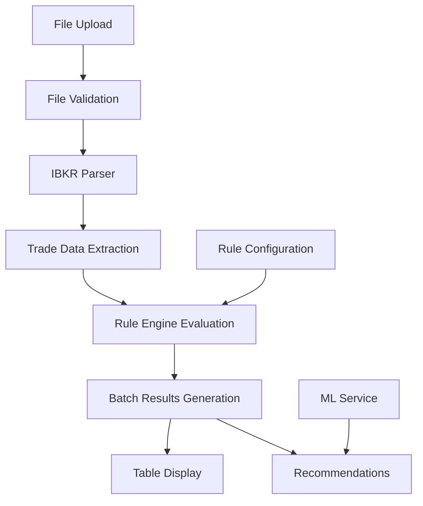

# Import & Analyze Page - Technical Architecture Documentation

## Overview

The Import & Analyze page represents a sophisticated trading statement processing and rule evaluation system designed specifically for Interactive Brokers (IBKR) activity statements. This document provides comprehensive technical documentation covering architecture, components, data flow, and maintenance guidelines.

**Version:** 2.1.0  
**Last Updated:** 2024-Q4  
**Maintainers:** Trading Helper Bot Team

## Table of Contents

1. [Architecture Overview](#architecture-overview)
2. [Component Hierarchy](#component-hierarchy)
3. [Data Flow Architecture](#data-flow-architecture)
4. [Core Components](#core-components)
5. [Integration Points](#integration-points)
6. [Security Considerations](#security-considerations)
7. [Performance Optimizations](#performance-optimizations)
8. [Error Handling Strategy](#error-handling-strategy)
9. [Testing Strategy](#testing-strategy)
10. [Maintenance Guidelines](#maintenance-guidelines)

## Architecture Overview

### Design Principles

The Import & Analyze page follows several key architectural principles:

- **Modular Component Design**: Each component has a single responsibility
- **Security-First Approach**: Client-side validation with comprehensive security checks
- **Accessible by Design**: Full keyboard navigation and screen reader support
- **Performance Optimized**: Memoization, lazy loading, and efficient rendering
- **Maintainable Code**: Comprehensive documentation and type safety

### Technology Stack

- **Frontend Framework**: React 19 with TypeScript
- **Styling**: Tailwind CSS with Bootstrap compatibility layer
- **State Management**: React hooks with custom state management
- **Data Processing**: Custom IBKR parser with rule engine integration
- **Testing**: Jest with React Testing Library
- **Build System**: Create React App with custom webpack configuration

## Component Hierarchy

```
ImportAnalyze (Page)
├── SecureDragDropUpload (Primary Upload Interface)
├── FileUploadSection (Legacy Upload Interface)
├── RuleEvaluationControls (Configuration & Triggers)
├── EnhancedTradesTable (Advanced Table Display)
├── TradesRuleTable (Basic Table Display)
└── DebugSection (Development Tools)
```

### Component Responsibilities

| Component | Primary Responsibility | Secondary Functions |
|-----------|----------------------|-------------------|
| `ImportAnalyze` | Page orchestration, state management | File parsing, rule evaluation coordination |
| `SecureDragDropUpload` | Secure file upload with validation | Drag-and-drop UX, accessibility support |
| `FileUploadSection` | Basic file upload interface | Bootstrap compatibility, legacy support |
| `RuleEvaluationControls` | Rule configuration and triggers | Persistent settings, batch evaluation |
| `EnhancedTradesTable` | Advanced data visualization | Filtering, sorting, pagination |
| `TradesRuleTable` | Basic tabular display | Mobile optimization, simplicity |
| `DebugSection` | Development and diagnostic tools | Raw data inspection, ML integration |

## Data Flow Architecture

### Primary Data Flow



### State Management Flow

1. **File State**: `null` → `File` → `parsed data`
2. **Parsing State**: `idle` → `processing` → `complete/error`
3. **Rule State**: `unconfigured` → `configured` → `evaluated`
4. **Display State**: `empty` → `data loaded` → `filtered/sorted`

### Data Transformation Pipeline

```typescript
// Data Flow Types
File → ValidationResult → ParsedData → TradeRecord[] → BatchResult[] → TableRow[]
```

## Core Components

### ImportAnalyze (Main Page)

**File**: `src/pages/ImportAnalyze.tsx`

**Key Responsibilities**:
- Orchestrates all child components
- Manages global state for file, parsing, and rule evaluation
- Handles IBKR statement parsing via service integration
- Coordinates rule engine evaluation
- Provides error boundaries and loading states

**State Management**:
```typescript
interface ImportAnalyzeState {
  file: File | null;
  parsing: boolean;
  parseResult: any | null;
  error: string | null;
  isEvaluating: boolean;
  batchResults: BatchResult[] | null;
  mlLoading: boolean;
  mlError: string | null;
  mlRecommendations: any[] | null;
}
```

**Key Functions**:
- `handleFileChange()`: File selection management
- `handleParse()`: IBKR statement parsing coordination
- `handleEvaluateRules()`: Rule engine integration
- `handleGetMLRecommendations()`: ML service integration

### SecureDragDropUpload

**File**: `src/components/ImportAnalyze/SecureDragDropUpload.tsx`

**Security Features**:
- File type validation (CSV, TXT only)
- File size limits (10MB default)
- Filename sanitization
- Control character filtering
- Directory traversal prevention
- Dangerous pattern detection

**Accessibility Features**:
- Full keyboard navigation (Enter/Space)
- ARIA labels and semantic HTML
- Screen reader compatibility
- Clear visual feedback for all states

**UX Enhancements**:
- Animated upload progress
- Real-time validation feedback
- Drag state visual feedback
- Error handling with actionable messages

### RuleEvaluationControls

**File**: `src/components/ImportAnalyze/RuleEvaluationControls.tsx`

**Configuration Management**:
- Persistent localStorage settings
- Multiple evaluation modes (Auto, Batch, Manual)
- Rule parameter configuration
- Real-time validation

**Evaluation Modes**:
- **Auto**: Automatic evaluation on file upload
- **Batch**: Manual trigger for all trades
- **Manual**: Single-trade evaluation with feedback

### EnhancedTradesTable

**File**: `src/components/ImportAnalyze/EnhancedTradesTable.tsx`

**Advanced Features**:
- Sorting, filtering, and pagination via `AccessibleTable`
- Real-time rule violation highlighting
- Financial data formatting with color coding
- Responsive design with mobile optimization
- Configurable column display and sizing

**Data Processing**:
- Merges trade data with batch evaluation results
- Transforms data for optimal display performance
- Handles large datasets efficiently
- Provides export capabilities

### TradesRuleTable

**File**: `src/components/ImportAnalyze/TradesRuleTable.tsx`

**Simple Implementation**:
- Basic HTML table with Bootstrap styling
- Direct prop mapping without transformation
- Responsive design with horizontal scrolling
- Lightweight alternative for mobile/legacy use

### DebugSection

**File**: `src/components/ImportAnalyze/DebugSection.tsx`

**Development Tools**:
- Raw JSON display of parse results
- Parser debug logs inspection
- ML recommendation integration
- Error diagnostics and troubleshooting

## Integration Points

### IBKR Parser Service

**Location**: `src/services/IBKRActivityStatementParser.ts`

**Integration**: Direct service calls from `ImportAnalyze` component

**Data Flow**: 
```
CSV File → Parser Service → Structured Trade Data → Component State
```

### Rule Engine Service

**Location**: `src/utils/ruleEngine/`

**Integration**: Batch evaluation triggered by `RuleEvaluationControls`

**Evaluation Types**:
- Cost basis validation
- Consecutive loss detection
- Position sizing rules
- Risk management compliance

### ML/HMM Service

**Location**: `src/services/HMMService.ts`

**Integration**: Optional recommendations via `DebugSection`

**Purpose**: Provides machine learning insights for trading patterns

### AccessibleTable Component

**Location**: `src/components/ui/AccessibleTable/`

**Integration**: Used by `EnhancedTradesTable` for advanced functionality

**Features**: Sorting, filtering, pagination, accessibility compliance

## Security Considerations

### File Upload Security

1. **File Type Validation**: Whitelist approach with MIME type checking
2. **Size Limits**: 10MB maximum to prevent DoS attacks
3. **Filename Sanitization**: Removes dangerous characters and patterns
4. **Content Validation**: Parser-level validation of file structure
5. **Local Processing**: No server-side file storage or transmission

### Data Privacy

1. **Local Processing**: All data remains in browser memory
2. **No Persistent Storage**: Files are not saved to disk
3. **Session-Only Data**: Data cleared on page refresh/navigation
4. **Secure Communication**: HTTPS-only for any external API calls

### Input Validation

1. **Client-Side Validation**: Comprehensive validation before processing
2. **Type Safety**: TypeScript ensures data type integrity
3. **Error Boundaries**: React error boundaries prevent crashes
4. **Sanitization**: All user inputs are sanitized before display

## Performance Optimizations

### React Optimizations

1. **Memoization**: `useMemo` and `useCallback` for expensive operations
2. **Lazy Loading**: Components loaded on demand
3. **Virtual Scrolling**: For large datasets in tables
4. **Efficient Re-renders**: Optimized dependency arrays

### Data Processing

1. **Streaming Processing**: Large files processed in chunks
2. **Web Workers**: CPU-intensive operations moved to background
3. **Caching**: Parsed data cached for quick access
4. **Pagination**: Large datasets split for better performance

### UI Performance

1. **Debounced Inputs**: Search and filter inputs debounced
2. **Smooth Animations**: CSS transitions for better UX
3. **Progressive Enhancement**: Core functionality works without JavaScript
4. **Responsive Images**: Optimized assets for different screen sizes

## Error Handling Strategy

### Error Categories

1. **Validation Errors**: File format, size, or content issues
2. **Parsing Errors**: IBKR statement parsing failures
3. **Rule Engine Errors**: Rule evaluation failures
4. **Network Errors**: ML service communication issues
5. **Runtime Errors**: JavaScript execution errors

### Error Display Strategy

1. **Contextual Errors**: Displayed near the relevant component
2. **Global Errors**: Page-level errors with clear messaging
3. **Actionable Messages**: Users receive guidance on how to resolve issues
4. **Error Recovery**: Users can retry operations after errors

### Error Logging

1. **Client-Side Logging**: Errors logged to browser console
2. **Error Boundaries**: React error boundaries capture and display errors
3. **User Feedback**: Optional error reporting mechanism
4. **Debug Information**: Comprehensive debug data in DebugSection

## Testing Strategy

### Unit Testing

- **Coverage Target**: 90%+ for critical components
- **Test Framework**: Jest with React Testing Library
- **Mock Strategy**: Service mocks for isolated testing
- **Snapshot Testing**: UI regression prevention

### Integration Testing

- **Component Integration**: Parent-child component interactions
- **Service Integration**: End-to-end file processing workflows
- **Rule Engine Testing**: Complete rule evaluation scenarios
- **Error Handling**: Error state and recovery testing

### Accessibility Testing

- **Screen Reader Testing**: NVDA, JAWS, VoiceOver compatibility
- **Keyboard Navigation**: Tab order and keyboard shortcuts
- **Color Contrast**: WCAG AA compliance
- **Focus Management**: Proper focus handling throughout workflows

### Performance Testing

- **Large File Processing**: Testing with maximum file sizes
- **Memory Usage**: Monitoring for memory leaks
- **Rendering Performance**: Table performance with large datasets
- **Mobile Performance**: Testing on various device types

## Maintenance Guidelines

### Code Standards

1. **TypeScript Compliance**: Strict type checking enabled
2. **ESLint Configuration**: Consistent code style enforcement
3. **Documentation Requirements**: JSDoc for all public APIs
4. **Component Standards**: Consistent prop interfaces and naming

### Documentation Maintenance

1. **Code Comments**: Inline comments for complex logic
2. **README Updates**: Keep component READMEs current
3. **Architecture Docs**: Update this document with changes
4. **API Documentation**: Maintain service interface docs

### Security Updates

1. **Dependency Updates**: Regular security patch installation
2. **Vulnerability Scanning**: Automated security scanning
3. **Security Reviews**: Regular code security reviews
4. **Penetration Testing**: Periodic security testing

### Performance Monitoring

1. **Bundle Size Monitoring**: Track and optimize bundle size
2. **Runtime Performance**: Monitor rendering performance
3. **Memory Usage**: Regular memory leak detection
4. **User Experience Metrics**: Core Web Vitals monitoring

### Refactoring Guidelines

1. **Incremental Changes**: Small, testable refactoring steps
2. **Backward Compatibility**: Maintain API compatibility
3. **Performance Impact**: Measure performance before/after
4. **Documentation Updates**: Update docs with refactoring

## Future Enhancements

### Planned Features

1. **Real-time Validation**: Live validation during file upload
2. **Advanced Filtering**: Additional table filtering options
3. **Export Functionality**: Enhanced data export capabilities
4. **Offline Support**: Progressive Web App features

### Architecture Improvements

1. **State Management**: Consider Redux for complex state
2. **Service Workers**: Background processing capabilities
3. **WebAssembly**: Performance-critical parsing operations
4. **Micro-frontends**: Component federation for scalability

---

**Document Version**: 1.0.0  
**Last Updated**: December 2024  
**Next Review**: March 2025 