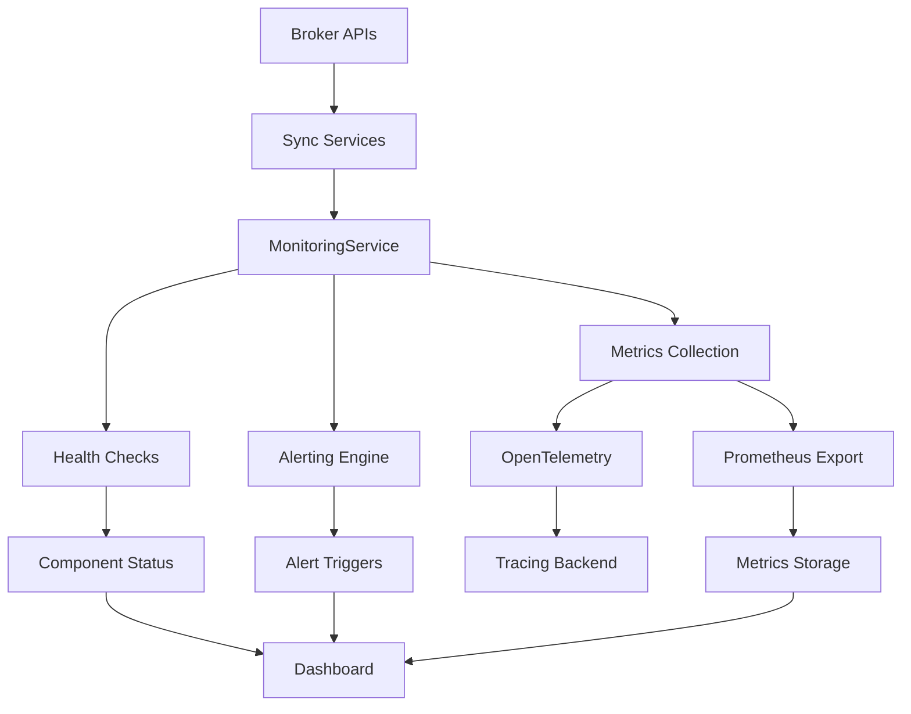

# Monitoring and Alerting System Documentation

## Overview

The Monitoring and Alerting System provides comprehensive observability for the trading-helper-bot's broker API synchronization processes. Built with OpenTelemetry integration, custom metrics collection, health checks, and real-time alerting capabilities, it ensures robust monitoring of system performance and reliability.

## Table of Contents

1. [System Architecture](#system-architecture)
2. [Core Components](#core-components)
3. [Installation & Setup](#installation--setup)
4. [Configuration](#configuration)
5. [Usage Examples](#usage-examples)
6. [Metrics Reference](#metrics-reference)
7. [Health Checks](#health-checks)
8. [Alerting System](#alerting-system)
9. [Dashboard Integration](#dashboard-integration)
10. [API Reference](#api-reference)
11. [Troubleshooting](#troubleshooting)

---

## System Architecture



### Key Components:
- **MonitoringService**: Central orchestration service
- **Metrics Collection**: Custom metrics with Prometheus export
- **Health Checks**: Component status monitoring
- **Alerting Engine**: Condition-based alert triggering
- **OpenTelemetry Integration**: Distributed tracing support
- **MonitoringDashboard**: Real-time UI for system status

---

## Core Components

### 1. MonitoringService (`src/services/MonitoringService.ts`)

Central service managing all monitoring operations:

```typescript
import MonitoringService from '../services/MonitoringService';

// Initialize monitoring
const monitoring = new MonitoringService();
await monitoring.initializeTracing('trading-bot');

// Record sync operation
monitoring.recordSyncOperation('schwab', 250, true);

// Update broker status
monitoring.updateBrokerStatus('schwab', {
  connected: true,
  lastHeartbeat: Date.now(),
  syncStatus: 'idle',
  errorCount: 0
});
```

### 2. MonitoringDashboard (`src/components/Dashboard/MonitoringDashboard.tsx`)

React component providing real-time monitoring visualization:

```typescript
import MonitoringDashboard from '../components/Dashboard/MonitoringDashboard';

// In your main dashboard
<MonitoringDashboard 
  refreshInterval={30000}
  onAlert={(alert) => console.log('Alert:', alert)}
/>
```

---

## Installation & Setup

### Prerequisites

```bash
# Install required packages
npm install @opentelemetry/api @opentelemetry/sdk-node
npm install @opentelemetry/instrumentation
npm install prometheus-client
```

### Basic Setup

```typescript
// app.ts or main entry point
import MonitoringService from './services/MonitoringService';

const monitoring = new MonitoringService();

// Initialize with tracing
await monitoring.initializeTracing('trading-helper-bot');

// Register default health checks
monitoring.registerHealthCheck('database', async () => {
  // Your database health check logic
  return {
    status: 'healthy',
    component: 'database',
    timestamp: Date.now(),
    responseTime: 15
  };
});

// Start periodic collection
// (automatic in constructor, configurable interval)
```

---

## Configuration

### Environment Variables

```bash
# OpenTelemetry Configuration
OTEL_SERVICE_NAME=trading-helper-bot
OTEL_EXPORTER_OTLP_ENDPOINT=http://localhost:4317
OTEL_LOG_LEVEL=info

# Monitoring Settings
MONITORING_METRICS_INTERVAL=30000    # 30 seconds
MONITORING_HEALTH_CHECK_INTERVAL=60000  # 60 seconds
MONITORING_ALERT_CHECK_INTERVAL=60000   # 60 seconds
```

### Service Configuration

```typescript
// Custom configuration during initialization
const monitoringConfig = {
  metricsInterval: 30000,
  healthCheckInterval: 60000,
  alertCheckInterval: 60000,
  enableTracing: true,
  exportPrometheus: true
};

const monitoring = new MonitoringService(monitoringConfig);
```

---

## Usage Examples

### 1. Recording Sync Operations

```typescript
// Successful sync
monitoring.recordSyncOperation('interactive-brokers', 180, true);

// Failed sync with error
monitoring.recordSyncOperation('schwab', 500, false, 'Connection timeout');

// With tracing
const span = monitoring.startSpan('broker-sync');
try {
  // Your sync logic here
  const duration = Date.now() - startTime;
  monitoring.recordSyncOperation('alpaca', duration, true);
  span?.setStatus({ code: 1, message: 'Success' });
} catch (error) {
  monitoring.recordSyncOperation('alpaca', duration, false, error.message);
  span?.setStatus({ code: 2, message: error.message });
} finally {
  span?.finish();
}
```

### 2. Custom Metrics

```typescript
// Register custom metric
monitoring.registerMetric({
  name: 'portfolio_value_usd',
  description: 'Total portfolio value in USD',
  type: 'gauge',
  labels: ['account', 'broker']
});

// Record metric values
monitoring.recordMetric('portfolio_value_usd', 125000, { 
  account: 'main', 
  broker: 'schwab' 
});

// Counter metric
monitoring.recordMetric('trades_executed_total', 1, { 
  symbol: 'SPY', 
  side: 'buy' 
});
```

### 3. Health Checks

```typescript
// Database health check
monitoring.registerHealthCheck('database', async () => {
  try {
    await db.query('SELECT 1');
    return {
      status: 'healthy',
      component: 'database',
      timestamp: Date.now(),
      responseTime: 12,
      details: { connections: 5 }
    };
  } catch (error) {
    return {
      status: 'unhealthy',
      component: 'database',
      timestamp: Date.now(),
      error: error.message
    };
  }
});

// Broker API health check
monitoring.registerHealthCheck('broker-apis', async () => {
  const brokers = ['schwab', 'interactive-brokers', 'alpaca'];
  const results = {};
  
  for (const broker of brokers) {
    try {
      await brokerServices[broker].ping();
      results[broker] = 'healthy';
    } catch (error) {
      results[broker] = 'unhealthy';
    }
  }
  
  const unhealthyCount = Object.values(results).filter(s => s === 'unhealthy').length;
  const status = unhealthyCount === 0 ? 'healthy' : 
                 unhealthyCount < brokers.length ? 'degraded' : 'unhealthy';
  
  return {
    status,
    component: 'broker-apis',
    timestamp: Date.now(),
    details: results
  };
});
```

### 4. Custom Alerts

```typescript
// High error rate alert
monitoring.registerAlert({
  name: 'high_sync_error_rate',
  condition: (metrics) => metrics.errorRate > 0.1, // 10% error rate
  severity: 'warning',
  cooldownMs: 300000, // 5 minutes
  description: 'Sync error rate exceeds 10%',
  runbook: 'Check broker connection status and API credentials'
});

// Low connection count alert
monitoring.registerAlert({
  name: 'low_broker_connections',
  condition: (metrics) => metrics.activeConnections < 2,
  severity: 'critical',
  cooldownMs: 60000, // 1 minute
  description: 'Less than 2 broker connections active',
  runbook: 'Verify broker services are running and credentials are valid'
});

// Custom portfolio alert
monitoring.registerAlert({
  name: 'portfolio_drift',
  condition: (metrics) => {
    // Custom logic for portfolio analysis
    const schwabMetrics = metrics.brokers['schwab'];
    return schwabMetrics && schwabMetrics.errorCount > 5;
  },
  severity: 'warning',
  cooldownMs: 1800000, // 30 minutes
  description: 'Schwab sync errors indicate potential portfolio drift'
});
```

---

## Metrics Reference

### Default Metrics

| Metric Name | Type | Description | Labels |
|-------------|------|-------------|---------|
| `broker_sync_total` | counter | Total broker synchronizations | `broker`, `status` |
| `broker_sync_duration_ms` | histogram | Sync operation duration | `broker` |
| `broker_connections_active` | gauge | Active broker connections | - |
| `broker_errors_total` | counter | Total broker errors | `broker`, `error_type` |
| `system_uptime_seconds` | gauge | Service uptime | - |

### Custom Metrics Example

```typescript
// Financial metrics
monitoring.registerMetric({
  name: 'portfolio_total_value',
  description: 'Total portfolio value across all accounts',
  type: 'gauge',
  labels: ['currency']
});

monitoring.registerMetric({
  name: 'trades_pnl_total',
  description: 'Total profit/loss from trades',
  type: 'gauge',
  labels: ['account', 'strategy']
});

monitoring.registerMetric({
  name: 'risk_exposure_ratio',
  description: 'Current risk exposure ratio',
  type: 'gauge',
  labels: ['account']
});
```

---

## Health Checks

### Built-in Health Checks

The system provides several built-in health check patterns:

```typescript
// Component availability
monitoring.registerHealthCheck('sync-service', async () => {
  return {
    status: syncService.isRunning() ? 'healthy' : 'unhealthy',
    component: 'sync-service',
    timestamp: Date.now(),
    details: {
      queueSize: syncService.getQueueSize(),
      workers: syncService.getActiveWorkers()
    }
  };
});

// External dependency
monitoring.registerHealthCheck('market-data-api', async () => {
  try {
    const response = await fetch('https://api.marketdata.com/health');
    return {
      status: response.ok ? 'healthy' : 'degraded',
      component: 'market-data-api',
      timestamp: Date.now(),
      responseTime: response.headers.get('response-time'),
      details: { statusCode: response.status }
    };
  } catch (error) {
    return {
      status: 'unhealthy',
      component: 'market-data-api',
      timestamp: Date.now(),
      error: error.message
    };
  }
});
```

### Health Check Status Levels

- **healthy**: Component is fully operational
- **degraded**: Component is operational but with reduced performance
- **unhealthy**: Component is not operational

---

## Alerting System

### Alert Configuration

```typescript
interface AlertConfig {
  name: string;                    // Unique alert identifier
  condition: (metrics) => boolean; // Alert trigger condition
  severity: 'info' | 'warning' | 'error' | 'critical';
  cooldownMs: number;             // Minimum time between alerts
  description: string;            // Human-readable description
  runbook?: string;               // Troubleshooting instructions
}
```

### Alert Examples

```typescript
// Performance degradation
monitoring.registerAlert({
  name: 'slow_sync_operations',
  condition: (metrics) => metrics.avgSyncDurationMs > 1000,
  severity: 'warning',
  cooldownMs: 600000, // 10 minutes
  description: 'Average sync duration exceeds 1 second',
  runbook: 'Check network latency and broker API status'
});

// Data freshness
monitoring.registerAlert({
  name: 'stale_sync_data',
  condition: (metrics) => {
    const lastSync = metrics.lastSyncTimestamp;
    const fiveMinutesAgo = Date.now() - (5 * 60 * 1000);
    return lastSync < fiveMinutesAgo;
  },
  severity: 'error',
  cooldownMs: 300000, // 5 minutes
  description: 'No successful sync in the last 5 minutes'
});
```

### Alert Handling

```typescript
// Listen for alerts
monitoring.on('alert:triggered', (alert) => {
  console.log(`ALERT [${alert.severity}]: ${alert.name}`);
  console.log(`Description: ${alert.description}`);
  
  // Send to external systems
  if (alert.severity === 'critical') {
    sendToSlack(alert);
    sendToPagerDuty(alert);
  } else if (alert.severity === 'error') {
    sendToSlack(alert);
  }
  
  // Log alert
  logger.warn('Alert triggered', {
    alert: alert.name,
    severity: alert.severity,
    metrics: alert.metrics
  });
});
```

---

## Dashboard Integration

### React Integration

```typescript
import React from 'react';
import MonitoringDashboard from '../components/Dashboard/MonitoringDashboard';

export const AdminDashboard: React.FC = () => {
  const handleAlert = (alert) => {
    // Handle alerts in your application
    toast.error(`Alert: ${alert.description}`);
  };

  return (
    <div className="admin-dashboard">
      <h1>System Administration</h1>
      <MonitoringDashboard 
        refreshInterval={15000}  // Refresh every 15 seconds
        onAlert={handleAlert}
      />
    </div>
  );
};
```

### Custom Dashboard Components

```typescript
// Custom metric display
import { useMonitoring } from '../hooks/useMonitoring';

export const BrokerStatusWidget: React.FC = () => {
  const { metrics, isLoading } = useMonitoring();
  
  if (isLoading) return <div>Loading...</div>;
  
  return (
    <div className="broker-status-widget">
      <h3>Broker Connections</h3>
      {Object.values(metrics.brokers).map(broker => (
        <div key={broker.broker} className="broker-item">
          <span>{broker.broker}</span>
          <StatusBadge 
            status={broker.connected ? 'connected' : 'disconnected'} 
          />
          <span>Errors: {broker.errorCount}</span>
        </div>
      ))}
    </div>
  );
};
```

---

## API Reference

### MonitoringService Methods

#### Core Methods

```typescript
// Initialize tracing
async initializeTracing(serviceName?: string): Promise<void>

// Record sync operation
recordSyncOperation(broker: string, durationMs: number, success: boolean, error?: string): void

// Update broker status
updateBrokerStatus(broker: string, status: Partial<BrokerStatus>): void

// Get metrics summary
getMetricsSummary(): { sync: SyncMetrics; brokers: Record<string, BrokerStatus>; uptime: number }

// Get service health
async getServiceHealth(): Promise<ServiceHealth>
```

#### Metrics Methods

```typescript
// Register custom metric
registerMetric(config: MetricConfig): void

// Record metric value
recordMetric(name: string, value: number, labels?: Record<string, string>): void

// Export Prometheus format
exportPrometheusMetrics(): string
```

#### Health Check Methods

```typescript
// Register health check
registerHealthCheck(component: string, checkFn: () => Promise<HealthCheckResult>): void

// Run all health checks
async runHealthChecks(): Promise<Map<string, HealthCheckResult>>
```

#### Alert Methods

```typescript
// Register alert
registerAlert(config: AlertConfig): void

// Check all alerts
checkAlerts(): void
```

#### Tracing Methods

```typescript
// Start span
startSpan(operationName: string, options?: any): Span | null

// Create child span
createChildSpan(parent: Span, operationName: string): Span | null
```

---

## Troubleshooting

### Common Issues

#### 1. Metrics Not Appearing

**Problem**: Custom metrics not showing up in exports

**Solutions**:
- Verify metric is registered before recording values
- Check metric name spelling
- Ensure labels match registration

```typescript
// ✅ Correct order
monitoring.registerMetric({
  name: 'custom_metric',
  description: 'My custom metric',
  type: 'gauge'
});
monitoring.recordMetric('custom_metric', 100);

// ❌ Wrong order
monitoring.recordMetric('custom_metric', 100); // Metric not registered yet
```

#### 2. Health Checks Failing

**Problem**: Health checks always returning unhealthy

**Solutions**:
- Add error handling in health check functions
- Verify dependencies are accessible
- Check timeout settings

```typescript
// ✅ Robust health check
monitoring.registerHealthCheck('database', async () => {
  try {
    const startTime = Date.now();
    await db.query('SELECT 1');
    const responseTime = Date.now() - startTime;
    
    return {
      status: responseTime < 1000 ? 'healthy' : 'degraded',
      component: 'database',
      timestamp: Date.now(),
      responseTime,
      details: { query: 'SELECT 1' }
    };
  } catch (error) {
    return {
      status: 'unhealthy',
      component: 'database',
      timestamp: Date.now(),
      error: error.message
    };
  }
});
```

#### 3. Alerts Not Triggering

**Problem**: Alert conditions met but no alerts fired

**Solutions**:
- Check alert cooldown periods
- Verify condition logic
- Ensure `checkAlerts()` is being called

```typescript
// Debug alert conditions
monitoring.registerAlert({
  name: 'debug_alert',
  condition: (metrics) => {
    console.log('Current metrics:', metrics); // Debug output
    return metrics.errorRate > 0.1;
  },
  severity: 'info',
  cooldownMs: 0, // Remove cooldown for testing
  description: 'Debug alert'
});
```

#### 4. Performance Issues

**Problem**: Monitoring causing performance degradation

**Solutions**:
- Increase collection intervals
- Reduce histogram sample sizes
- Optimize health check queries

```typescript
// Performance-optimized configuration
const monitoring = new MonitoringService({
  metricsInterval: 60000,    // 1 minute instead of 30 seconds
  healthCheckInterval: 120000, // 2 minutes
  maxHistogramSamples: 100   // Limit sample size
});
```

### Debug Mode

Enable debug logging for troubleshooting:

```typescript
// Enable debug mode
const monitoring = new MonitoringService({ debug: true });

// Or via environment
process.env.MONITORING_DEBUG = 'true';
```

### Monitoring the Monitor

Set up meta-monitoring to ensure the monitoring system itself is healthy:

```typescript
// Monitor the monitoring service
monitoring.registerHealthCheck('monitoring-service', async () => {
  const metrics = monitoring.getMetricsSummary();
  const lastCollection = monitoring.getLastCollectionTime();
  const fiveMinutesAgo = Date.now() - (5 * 60 * 1000);
  
  return {
    status: lastCollection > fiveMinutesAgo ? 'healthy' : 'unhealthy',
    component: 'monitoring-service',
    timestamp: Date.now(),
    details: {
      lastCollection,
      metricsCount: Object.keys(metrics).length,
      uptime: metrics.uptime
    }
  };
});
```

---

## Best Practices

1. **Metric Naming**: Use consistent naming conventions (`service_component_metric_unit`)
2. **Label Cardinality**: Keep label combinations reasonable to avoid metric explosion
3. **Health Check Timeouts**: Implement timeouts to prevent hanging health checks
4. **Alert Tuning**: Start with conservative thresholds and tune based on baseline data
5. **Documentation**: Document custom metrics and alerts for team knowledge sharing

---

## Integration Examples

### Express.js Middleware

```typescript
import express from 'express';
import monitoring from './services/MonitoringService';

const app = express();

// Monitoring middleware
app.use('/metrics', (req, res) => {
  res.set('Content-Type', 'text/plain');
  res.send(monitoring.exportPrometheusMetrics());
});

app.use('/health', async (req, res) => {
  const health = await monitoring.getServiceHealth();
  res.status(health.status === 'unhealthy' ? 503 : 200).json(health);
});
```

### Grafana Dashboard

```json
{
  "dashboard": {
    "title": "Trading Bot Monitoring",
    "panels": [
      {
        "title": "Sync Success Rate",
        "type": "stat",
        "targets": [
          {
            "expr": "rate(broker_sync_total{status=\"success\"}[5m]) / rate(broker_sync_total[5m]) * 100"
          }
        ]
      },
      {
        "title": "Broker Connections",
        "type": "graph",
        "targets": [
          {
            "expr": "broker_connections_active"
          }
        ]
      }
    ]
  }
}
```

---

This comprehensive monitoring system provides full observability into your trading bot's broker synchronization processes, enabling proactive issue detection and rapid troubleshooting. 