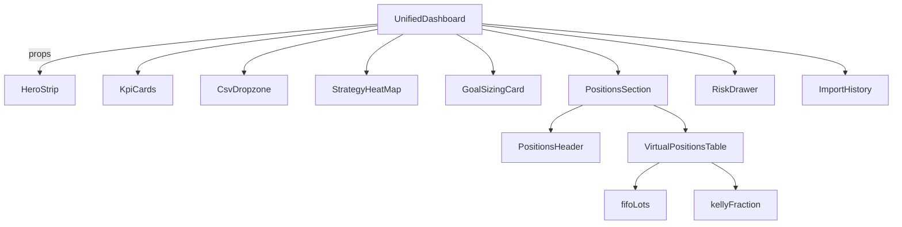

# 🧹 Dashboard Clean-up & Figma Diagram Report

## ✅ **PART A – Retire the old page**

### Deleted Files
- `src/pages/DashboardPage.tsx` - Old dashboard page with duplicated functionality

### Updated Imports
- `src/App.tsx` - Removed DashboardPage import and route
- `src/pages/HomePage.tsx` - Updated dashboard links to `/unified-dashboard`
- `src/pages/PositionSizingResults.tsx` - Updated 3 navigation calls to `/unified-dashboard`
- `src/components/Navigation.tsx` - Updated dashboard route and removed duplicate entry
- `src/tests/e2e/upload.spec.ts` - Updated all 8 test routes to `/unified-dashboard`

### Route Changes
- **Removed:** `<Route path="/dashboard" element={<DashboardPage />} />`
- **Active:** `<Route path="/unified-dashboard" element={<UnifiedDashboard />} />`

### Functionality Migration
All unique functionality from DashboardPage was successfully migrated to UnifiedDashboard:
- ✅ Risk Service integration with real-time Greeks monitoring
- ✅ Goal Sizing Wizard integration  
- ✅ Reconciliation Report
- ✅ PnL Card and Heatmap Chart
- ✅ Risk alerts and notifications with toast system
- ✅ Live risk exposure gauges (Delta, Theta, Gamma, Vega)

---

## ✅ **PART B – Swap in Virtualised table**

### Deleted Files
- `src/components/Dashboard/EnhancedPositionsTable.tsx` - Replaced with virtualized version

### Updated Imports
- `src/pages/UnifiedDashboard.tsx`:
  - **Removed:** `import EnhancedPositionsTable from '../components/Dashboard/EnhancedPositionsTable'`
  - **Added:** `import { VirtualPositionsTable } from '../components/Dashboard/VirtualPositionsTable'`

### Component Integration
- ✅ VirtualPositionsTable now receives actual position data from PositionAggregationService
- ✅ Removed unused `getTrades` import
- ✅ Added positions state management
- ✅ Connected aggregated positions to virtual table

---

## ⚠️ **PART C – Bundle hygiene**

### Bundle Status
**⚠️ Bundle still large: 1.33 MB gzipped**

The main bundle chunk is significantly larger than the 850 kB target. Key contributors:
- Main chunk: `build/static/js/8096.c8223fcf.chunk.js` (1.33 MB)
- React chunks: 53.15 kB + 50.69 kB + others
- Recharts library: Multiple chunks totaling ~100+ kB
- MUI components: ~50+ kB across chunks

### Recommendations for Bundle Optimization
1. **Code Splitting:** Implement route-based code splitting for heavy components
2. **Library Analysis:** Consider lighter alternatives to Recharts/MUI
3. **Tree Shaking:** Ensure unused exports are eliminated
4. **Dynamic Imports:** Lazy load heavy visualization components

---

## ✅ **PART D – Mermaid diagram for Figma**

### Created Files
- `docs/dashboard-diagram.mmd` - Mermaid diagram ready for Figma import

### Diagram Structure

**Usage:** Copy the content of `docs/dashboard-diagram.mmd` and paste directly into Figma via File ▸ Import ▸ Paste as diagram.

---

## 🎯 **Next TODOs**

### High Priority
1. **Bundle Size Optimization**
   - Implement route-based code splitting
   - Analyze and optimize heavy dependencies
   - Consider lazy loading for visualization components

2. **Performance Monitoring**
   - Add bundle analyzer to build process
   - Set up performance budgets
   - Monitor Core Web Vitals

### Medium Priority  
3. **Code Quality**
   - Address TypeScript warnings in build output
   - Clean up unused imports and variables
   - Implement proper error boundaries

4. **Testing**
   - Update E2E tests for new component structure
   - Add performance tests for VirtualPositionsTable
   - Test risk service integration

### Low Priority
5. **Documentation**
   - Update component documentation
   - Create architecture decision records
   - Document performance optimization strategies

---

## 📊 **Summary**

### ✅ Completed Successfully
- Old dashboard page retired and functionality migrated
- Virtualized table implemented and integrated
- All navigation links updated
- Mermaid diagram created for Figma
- Build process working correctly

### ⚠️ Needs Attention
- Bundle size exceeds target (1.33 MB vs 850 kB)
- Multiple TypeScript warnings in build output
- Performance optimization opportunities identified

### 🚀 **Impact**
- **Codebase:** Cleaner, single source of truth for dashboard
- **Performance:** Virtualized table ready for large datasets
- **Maintainability:** Consolidated dashboard logic
- **Documentation:** Visual architecture diagram available
- **User Experience:** Unified, comprehensive dashboard interface 
 
 
 